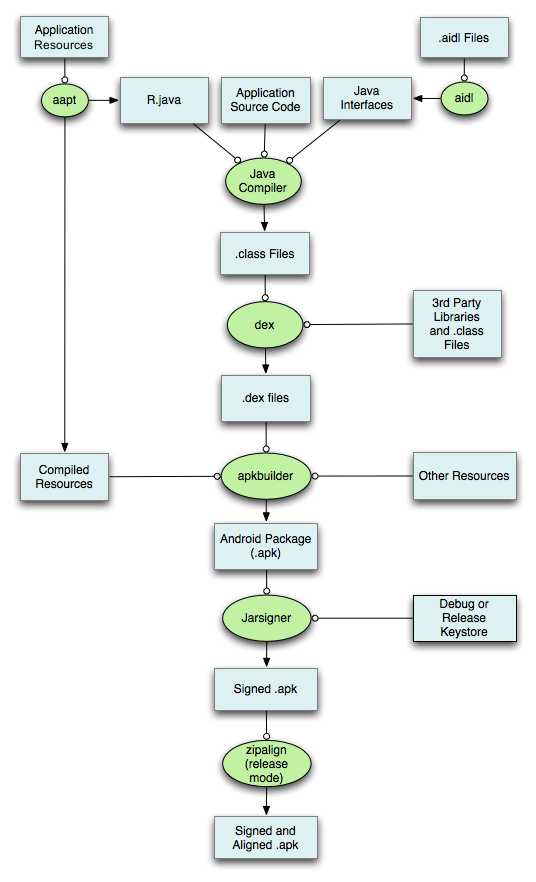

## Android 


### 一.Android系统架构


#### 1.应用层

##### **系统应用**

##### 	短信、日历、浏览器等

##### **开发者应用**

* Application
* Context
* Activity/Window/View
* Service
* Fragment

#### 2.API FrameWork层

* 各类Manager，如ActivityManager、PackageManager、WindowManager
* View System
* ContentProvider

#### 3.系统库和Android运行时

##### **Android运行库**

ART虚拟机和核心类库，Android5.0之前是Dalvik虚拟机

ART的优势如下：

- 预先 (AOT) 和即时 (JIT) 编译
- 优化的垃圾回收 (GC)
- 在 Android 9（API 级别 28）及更高版本的系统中，支持将应用软件包中的 [Dalvik Executable 格式 (DEX) 文件转换为更紧凑的机器代码](https://developer.android.com/about/versions/pie/android-9.0?hl=zh-cn#art-aot-dex)。
- 更好的调试支持

##### **C/C++ Library**

原生应用，通过JNI调用，NDK开发

Surface Manager、WebKit、Sqlite等

#### 4.硬件抽象层

向JavaAPI层显示硬件功能

#### 5.Linux内核层

提供系统管理如内存管理，进程管理，网络协议，驱动管理（音频驱动，蓝牙驱动，Binder驱动,Wifi）。

#### 6.Binder通信层

Binder在各层之间通信有重要作用

### 二.Android系统启动流程


### 三.APK打包流程




#### 1. 打包资源文件，生成R.java文件

打包资源文件的工具是`aapt（The Android Asset Packaing Tool）`，目录 `sdk\build-tools\25.0.0\aapt`。

在这个过程中，项目中的`AndroidManifest.xml文件和布局文件XML`都会编译，然后生成相应的`R.java`，另外AndroidManifest.xml会被aapt编译成二进制。

存放在APP的res目录下的资源，该类资源在APP打包前大多会被编译，变成二进制文件，并会为每个该类文件赋予一个resource id。对于该类资源的访问，应用层代码则是通过resource id进行访问的。

Android应用在编译过程中aapt工具会对资源文件进行编译，并生成一个resource.arsc文件，`resource.arsc文件相当于一个文件索引表`，记录了很多跟资源相关的信息。

##### **资源ID**

格式为：PPTTNNNN

* PP表示包名，在Application中总是0x7f
* TT表示Type
* NNNN表示资源名称

是4个字节的无符号整数，在R.java文件中用16进制表示。其中，最高的1字节表示Package ID，次高1个字节表示Type ID，最低2字节表示Entry ID。AAPT分配过程中通常会取下一个可用数字分配，举例：

```xml
layout/main.xml
drawable/icon.xml
layout/listitem.xml
```

在遇到`layout/main.xml`时候，资源Type是layout，分配01,Name是main，分配01，ID结果就是0x7f010001

再分配`drawable/icon.xml`,Type的01已经分配给layout了,所以下一个可用的Type是02，Name可分配是0001，ID结果就是0x7f020001

最后看`layout/listitem.xml`,layout的Type已经有了是01，不用再分配了。Name的0001已经被占用，只能继续分配0002，所以ID就是0x7f010002


#### 2. 处理aidl文件，生成相应的Java文件

处理aidl文件的工具是`aidl（Android Interface Definition Language）`，即Android接口描述语言

aidl工具解析接口定义文件然后生成相应的Java代码接口供程序调用。如果在项目没有使用到aidl文件，则可以跳过这一步。

#### 3. 编译项目源代码，生成class文件

编译源代码使用工具是 `Java`编译器`（javac）`

项目中所有的`Java`代码，包括`R.java`和`.aidl`，都会变Java编译器（javac）编译成`.class`文件.

#### 4. 转换所有的class文件，生成classes.dex文件

这过程使用工具 `dx（dex）`生成可供Android系统Dalvik虚拟机执行的`classes.dex`文件

任何第三方的libraries和.class文件都会被转换成.dex文件。dx工具的主要工作是将`Java字节码`转成 `Dalvik	`字节码、压缩常量池、消除冗余信息等。

#### 5. 打包生成APK文件

打包的工具`apkbuilder`，`apkbuilder`为一个脚本文件，实际调用的是（sdk\tools\lib）文件中的com.android.sdklib.build.ApkbuilderMain类。

所有没有编译的资源，如images、assets目录下资源（该类文件是一些原始文件，APP打包时并不会对其进行编译，而是直接打包到APP中，对于这一类资源文件的访问，应用层代码需要通过文件名对其进行访问）；

编译过的资源和.dex文件以及未编译的资源都会被apkbuilder工具打包到最终的.apk文件中。

#### 6. 对APK文件进行签名

APK必须被签名才能被安装在设备上。debug和release两种

#### 7. 对签名后的APK文件进行对齐处理

如果你发布的apk是正式版的话，就必须对APK进行对齐处理，用到的工具是`zipalign`

对齐的主要过程是将APK包中所有的资源文件距离文件起始偏移为4字节整数倍，这样通过内存映射访问apk文件时的速度会更快。对齐的作用就是减少运行时内存的使用。

##### **zipalign**

zipalign 是一种归档对齐工具，其目的是要确保所有未压缩数据的开头均相对于文件开头部分执行特定的对齐。具体来说，它会使 APK 中的所有未压缩数据（例如图片或原始文件）在 4 字节边界上对齐。这样一来，即可使用 `mmap()` 直接访问所有部分，即使其中包含具有对齐限制的二进制数据也没关系。这样做的好处是可以减少运行应用时消耗的 RAM 容量。

- 如果您使用的是 `apksigner`，则只能在为 APK 文件签名**之前**执行 zipalign。如果您在使用 apksigner 为 APK 签名之后对 APK 做出了进一步更改，签名便会失效。
- 如果您使用的是 `jarsigner`，则只能在为 APK 文件签名**之后**执行 zipalign。

### 四.APK安装过程

看一下AS的installDebug的命令

```
> Task :app:installDebug
02:51:13 V/ddms: execute: running am get-config
02:51:13 V/ddms: execute 'am get-config' on 'emulator-5554' : EOF hit. Read: -1
02:51:13 V/ddms: execute: returning
Installing APK 'app-debug.apk' on 'root(AVD) - 10' for app:debug
02:51:13 D/app-debug.apk: Uploading app-debug.apk onto device 'emulator-5554'
02:51:13 D/Device: Uploading file onto device 'emulator-5554'
02:51:13 D/ddms: Reading file permision of /Users/xxx/xxx/app/build/outputs/apk/debug/app-debug.apk as: rw-r--r--
02:51:13 V/ddms: execute: running pm install -r -t "/data/local/tmp/app-debug.apk"
02:51:13 V/ddms: execute 'pm install -r -t "/data/local/tmp/app-debug.apk"' on 'emulator-5554' : EOF hit. Read: -1
02:51:13 V/ddms: execute: returning
02:51:13 V/ddms: execute: running rm "/data/local/tmp/app-debug.apk"
02:51:13 V/ddms: execute 'rm "/data/local/tmp/app-debug.apk"' on 'emulator-5554' : EOF hit. Read: -1
02:51:13 V/ddms: execute: returning
```

#### 安装过程

* PackageManager#installPackage

* PackageManagerService#mHandler#INIT_COPY //发通知开始拷贝
* PackageManagerService#mHandler#MCS_BOUND
* HandlerParams#startCopy
  * PMS#handleStartCopy
  * PMS#handleReturnCode

* PackageManagerService#processPendingInstall
* PMS#installPackageTracedLI
  * PMS#installPackageLI
  * PackageParser#parsePackage#parseClusterPackage //一系列解析
    * parseBaseApkCommon 解析manifest/application/权限
    * parseSplitApplication 解析四大组件添加到Package类中（维护了四大组件的ArrayList），
  * PMS#installNewPackageLIF
  * PackageDexOptimizer.performDexOpt //根据包类型优化dex
* BackupManagerService#restoreAtInstall //完成安装
  * mPackageManagerBinder.finishPackageInstall
* PMS#mHandler.obtainMessage(POST_INSTALL)
  * sendPackageBroadcast(Intent.ACTION_PACKAGE_ADDED, packageName)


#### 注册四大组件

内部维护一个mPackages变量`ArrayMap<String, PackageParser.Package>`,以packageName为Key，

还有若干个ArrayMap,四大组件的Intent

AMS想要启动Activity的时候会调用`PMS.getActivityInfo`方法，

### 五.APP启动过程

* 点击桌面App图标，Launcher进程采用Binder IPC向system_server进程发起startActivity请求；
* system_server进程接收到请求后判断，如果不存在目标进程则通过AMS向zygote进程发送创建进程的请求（通过Socket）；
* Zygote进程fork出新的子进程，即App进程,实例化ActivityThread类，准备好Looper开启消息循环
* App进程，通过Binder IPC(AMS的attachApplication)向sytem_server进程发起bindApplication请求；
* 实例化Application，回调onCreate方法，后续就是startActivity的流程了
* system_server进程在收到请求后，进行一系列准备工作后（同上），再通过binder IPC向App进程发送scheduleLaunchActivity请求；
* App进程的binder线程（ApplicationThread）在收到请求后，通过handler向主线程发送LAUNCH_ACTIVITY消息；
* 主线程在收到Message后，通过反射机制创建目标Activity，并回调Activity.onCreate()等方法。
* 到此，App便正式启动，开始进入Activity生命周期，执行完onCreate/onStart/onResume方法，UI渲染结束后便可以看到App的主界面。

#### 涉及角色

- Instrumentation: 监控应用与系统相关的交互行为。
- AMS：组件管理调度中心，什么都不干，但是什么都管。
- ActivityStarter：Activity启动的控制器，处理Intent与Flag对Activity启动的影响，具体说来有：1 寻找符合启动条件的Activity，如果有多个，让用户选择；2 校验启动参数的合法性；3 返回int参数，代表Activity是否启动成功。
- ActivityStackSupervisior：这个类的作用你从它的名字就可以看出来，它用来管理任务栈。
- ActivityStack：用来管理任务栈里的Activity。
- ActivityThread：最终干活的人，是ActivityThread的内部类，Activity、Service、BroadcastReceiver的启动、切换、调度等各种操作都在这个类里完成。

#### 涉及进程

- 调用者进程，如果是在桌面启动应用就是Launcher应用进程。
- ActivityManagerService等所在的System Server进程，该进程主要运行着系统服务组件。
- Zygote进程，该进程主要用来fork新进程。
- 新启动的应用进程


### 参考

https://www.jianshu.com/p/019c735050e0

https://juejin.im/post/5aa621bb51882510fd3f43c3#heading-3

