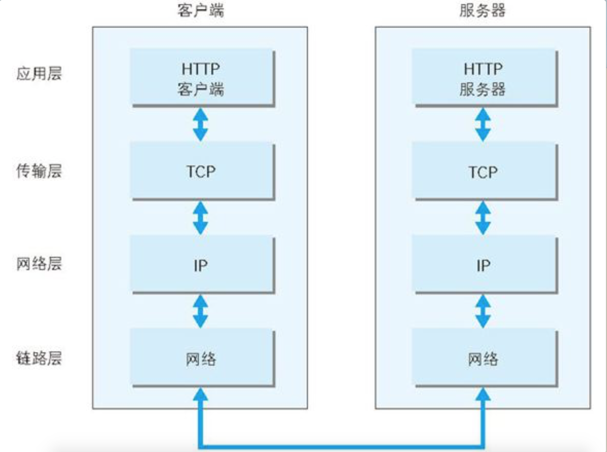
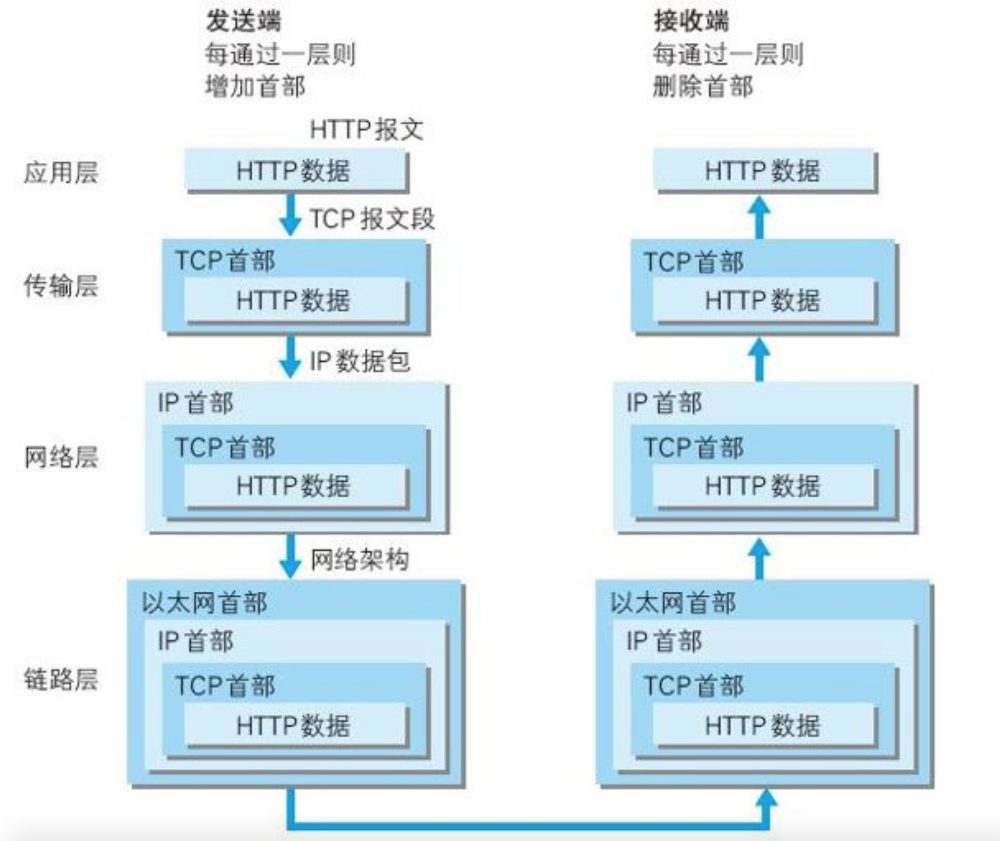
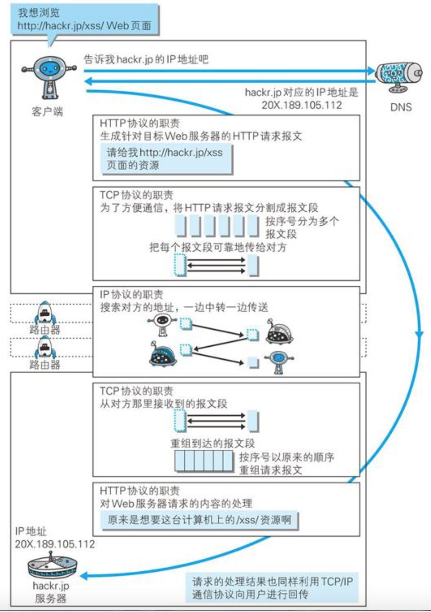
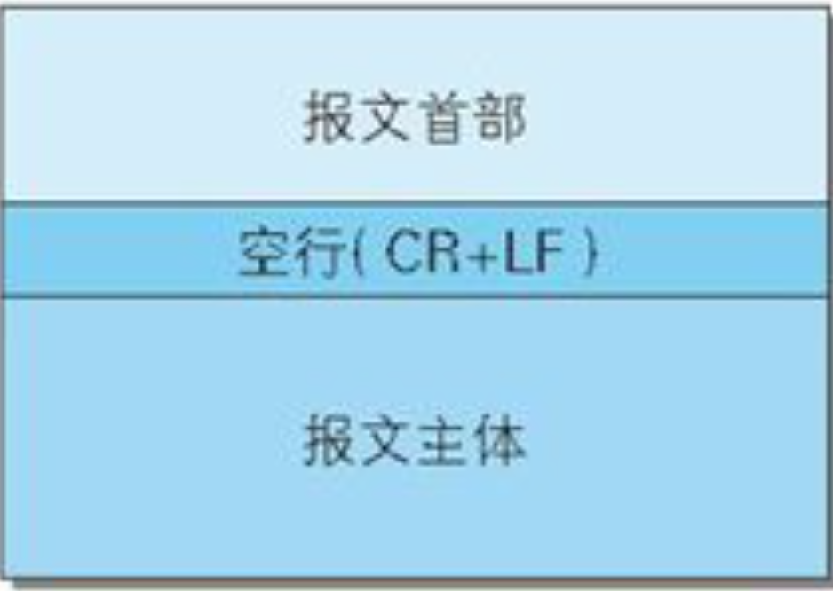

## HTTP


### TCP/IP协议

计算机与网络设备要相互通信，双方就必须基于相同的方法。比如，如何找到通信目标、由哪一边先发起通信、使用哪种语言进行通信、怎样结束通信等规则都需要事先确定。还有不同的硬件、操作系统之间的通信，所有的这一切都需要一种规则。这种规则就是协议（protocol）。

互联网相关联的协议集合起来总称为TCP/IP协议。


TCP/IP协议族按层次分别分为以4层：应用层、传输层、网络层和数据链路层。



#### 1.应用层

应用层决定了向用户提供应用服务时通信的活动。

TCP/IP协议族内预存了各类通用的应用服务。比如，FTP（File Transfer Protocol，文件传输协议）和DNS（Domain Name System，域名系统）服务就是其中两类。

HTTP协议也处于该层。

#### 2.传输层

传输层对上层应用层，提供处于网络连接中的两台计算机之间的数据传输。在传输层有两个性质不同的协议：

* TCP（Transmission Control Protocol，传输控制协议）
* UDP（User Data Protocol，用户数据报协议）

#### 3.网络层（又名网络互连层）

网络层用来处理在网络上流动的数据包。数据包是网络传输的最小数据单位。该层规定了通过怎样的路径（所谓的传输路线）到达对方计算机，并把数据包传送给对方。

与对方计算机之间通过多台计算机或网络设备进行传输时，网络层所起的作用就是在众多的选项内选择一条传输路线。

#### 4.链路层（又名数据链路层，网络接口层）

用来处理连接网络的硬件部分。包括控制操作系统、硬件的设备驱动、NIC（Network Interface Card，网络适配器，即网卡），及光纤等物理可见部分（还包括连接器等一切传输媒介）。硬件上的范畴均在链路层的作用范围之内。

### HTTP 相关协议

先来看一个HTTP传输过程的简略图



#### 1.IP

IP协议的作用是把各种数据包传送给对方。而要保证确实传送到对方那里，则需要满足各类条件。其中两个重要的条件是IP地址和MAC地址。

IP地址指明了节点被分配到的地址，MAC地址是指网卡所属的固定地址。IP地址可以和MAC地址进行配对。IP地址可变换，但MAC地址基本上不会更改。

IP间的通信依赖MAC地址。但是通信的双方在同一局域网（LAN）内的情况是很少的，通常是经过多台计算机和网络设备中转才能连接到对方。而在进行中转时，会利用下一站中转设备的MAC地址来搜索下一个中转目标。这时，会采用ARP协议（Address Resolution Protocol）。ARP是一种用以解析地址的协议，根据通信方的IP地址就可以反查出对应的MAC地址。

在到达通信目标前的中转过程中，计算机和路由器等网络设备只能获悉很粗略的传输路线，这种机制称为路由选择。

#### 2.TCP

TCP位于传输层，提供可靠的字节流服务。所谓的字节流服务（Byte Stream Service）是指，为了方便传输，将大块数据分割成以报文段（segment）为单位的数据包进行管理。而可靠的传输服务是指，能够把数据准确可靠地传给对方。一言以蔽之，TCP协议为了更容易传送大数据才把数据分割，而且TCP协议能够确认数据最终是否送达到对方。

为了准确无误地将数据送达目标处，TCP协议采用了三次握手策略。用TCP协议把数据包送出去后，TCP不会对传送后的情况置之不理，它一定会向对方确认是否成功送达。握手过程中使用了TCP的标志（flag）——SYN（synchronize）和ACK（acknowledgement）。

发送端首先发送一个带SYN标志的数据包给对方。接收端收到后，回传一个带有SYN/ACK标志的数据包以示传达确认信息。最后，发送端再回传一个带ACK标志的数据包，代表“握手”结束。

#### 3.DNS

计算机既可以被赋予IP地址，也可以被赋予主机名和域名。比如www.hackr.jp。

DNS（Domain Name System）服务是和HTTP协议一样位于应用层的协议。它提供域名到IP地址之间的解析服务。

DNS协议提供通过域名查找IP地址，或逆向从IP地址反查域名的服务。




### HTTP基本信息

先看一个简单的请求过程内容

```shell
➜  ~ curl www.baidu.com -v
*   Trying 180.101.49.11...
* TCP_NODELAY set
* Connected to www.baidu.com (180.101.49.11) port 80 (#0)
//请求内容
> GET / HTTP/1.1
> Host: www.baidu.com
> User-Agent: curl/7.64.1
> Accept: */*
//响应内容
< HTTP/1.1 200 OK
< Accept-Ranges: bytes
< Cache-Control: private, no-cache, no-store, proxy-revalidate, no-transform
< Connection: keep-alive
< Content-Length: 2381
< Content-Type: text/html
< Date: Thu, 26 Mar 2020 09:59:45 GMT
< Etag: "588604c8-94d"
< Last-Modified: Mon, 23 Jan 2017 13:27:36 GMT
< Pragma: no-cache
< Server: bfe/1.0.8.18
< Set-Cookie: BDORZ=27315; max-age=86400; domain=.baidu.com; path=/
...省略内容
```


#### 1.请求/响应报文格式

请求报文是由请求方法、请求URI、协议版本、可选的请求首部字段和内容实体构成的。

响应报文基本上由协议版本、状态码（表示请求成功或失败的数字代码）、用以解释状态码的原因短语、可选的响应首部字段以及实体主体构成。

HTTP是一种无状态协议

#### 2.请求方法

支持的方法共七种

| **方法名** | 说明                                                         |
| ---------- | ------------------------------------------------------------ |
| GET        | 获取资源                                                     |
| POST       | 传输实体主体                                                 |
| HEAD       | 获取响应报文首部，不返回报文主体                             |
| PUT        | 传输文件，无验证机制（除非使用验证机制或者REST（表征状态转移）） |
| TRACE      | 路径追踪，查看请求是如何被修改的（不好用）                   |
| DELETE     | 删除指定资源                                                 |
| CONNECT    | 要求使用隧道协议连接代理，通常使用SSL和TLS                   |
| OPTIONS    | 查询请求指定URI资源支持的方法                                |


#### 3.持久链接

HTTP协议的初始版本中，每进行一次HTTP通信就要断开一次TCP连接。

HTTP/1.1和一部分的HTTP/1.0想出了持久连接（HTTP Persistent Connections，也称为HTTP keep-alive或HTTP connection reuse）的方法。

持久连接的特点是，只要任意一端没有明确提出断开连接，则保持TCP连接状态。

减少了TCP连接的重复建立和断开所造成的额外开销，减轻了服务器端的负载。提高响应速度。

在HTTP/1.1中，所有的连接默认都是持久连接

##### **管线化**

持久连接使得多数请求以管线化（pipelining）方式发送成为可能。从前发送请求后需等待并收到响应，才能发送下一个请求。管线化技术出现后，不用等待响应亦可直接发送下一个请求。


#### 4.Cookie管理

HTTP是无状态协议，它不对之前发生过的请求和响应的状态进行管理。也就是说，无法根据之前的状态进行本次的请求处理。

无状态协议当然也有它的优点。设计简单，由于不必保存状态，自然可减少服务器的CPU及内存资源的消耗。

引入了Cookie技术解决状态信息问题。Cookie技术通过在请求和响应报文中写入Cookie信息来控制客户端的状态。

Cookie会根据从服务器端发送的响应报文内的一个叫做Set-Cookie的首部字段信息，通知客户端保存Cookie。当下次客户端再往该服务器发送请求时，客户端会自动在请求报文中加入Cookie值后发送出去。

服务器端发现客户端发送过来的Cookie后，会去检查究竟是从哪一个客户端发来的连接请求，然后对比服务器上的记录，最后得到之前的状态信息。


### HTTP报文的HTTP信息

#### 1.基本信息

HTTP 报文大致可以分为报文首部和报文主体两部分，二者通过空行分割。



请求报文和响应报文由一下部分组成

* 请求行：包含请求方法，请求URI，HTTP版本
* 响应状态行：包含响应结果的状态码，原因短语，HTTP版本
* 首部字段：包含请求和响应的各种条件和属性的各类首部，大致有以下四种
  * 通用首部
  * 请求首部
  * 响应首部
  * 实体首部
* 其他


#### 2.编码提高效率


#### 3.多种数据多部分对象集合


#### 4.部分内容的范围请求

HTTP提供了一种可恢复的机制。所谓恢复是指能从之前下载中断处恢复下载。

要实现该功能需要指定下载的实体范围。像这样，指定范围发送的请求叫做范围请求（Range Request）

执行范围请求时，会用到首部字段Range来指定资源的byte范围。byte范围的指定形式如下。

● 5001~10 000字节

Range: bytes=5001-10000

● 从5001字节之后全部的

Range: bytes=5001-

● 从一开始到3000字节和5000~7000字节的多重范围

Range: bytes=0-3000, 5000-7000

针对范围请求，响应会返回状态码为206 Partial Content的响应报文。

对于多重范围的范围请求，响应会在首部字段Content-Type标明multipart/byteranges后返回响应报文。

### HTTP状态码

#### 2XX 成功

* 200 OK，正常处理
* 204 Not Content，请求成功但是没有资源可以返回
* 206 Partial Content，客户端进行的范围请求

#### 3XX重定向

* 301 Move Permanently, 永久性重定向，在Location首部字段中保存新的URI
* 302 Found 临时性重定向，希望用户本次使用新的URI访问
* 303 See Other  由于请求对应的资源存在着另一个URI，应使用GET方法定向获取请求的资源。
* 304 Not Modified 客户端发送附带条件的请求（If-Range，If—Modified-Since）,服务端因为条件不满足而不返回资源。

#### 4XX客户端错误

* 404 Bad Request 语法错误
* 401 Unauthorized,请求需要有HTTP验证的信息
* 403 Forbidden 服务器拒绝响应
* 404 Not Found 服务器无法找到资源

#### 5XX服务端错误

* 500 Internal Server Error  服务器发生了错误
* 503 Service Unavailable 服务器处于超负荷或者停机状态，无法处理请求


### HTTP首部信息


#### 1.通用首部

| 首部字段名        | 含义                       |
| ----------------- | -------------------------- |
| Cache-Control     | 控制缓存的行为             |
| Connection        | 连接的管理                 |
| Date              | 创建报文的日期             |
| PraGma            | 报文指令                   |
| Upgrade           | 升级为其他协议             |
| Via               | 代理服务器的相关信息       |
| Transfer-Encoding | 指定报文主体的编码传输方式 |
| Trailer           | 报文末端的首部一览         |
| Warning           | 错误通知                   |

#### 2.请求首部

| 首部字段名        | 含义                               |
| ----------------- | ---------------------------------- |
| Range             | 实体的字节请求范围                 |
| User-Agent        | HTTP客户端程序的信息               |
| Host              | 请求资源所在服务器                 |
| If-Match          | 比较实体标记                       |
| If-Modified-Since | 比较资源的更新时间                 |
| If-Range          | 资源未更新时发送实体Byte的请求范围 |
| Authorization     | Web的认证信息                      |
| Accept            | 用户代理可处理的媒体类型           |
| Accept-Charset    | 优先字符集                         |


#### 3.响应首部

| 首部字段名    | 含义                    |
| ------------- | ----------------------- |
| Location      | 另客户端重定向到指定URI |
| Accept-Ranges | 是否接收字节范围请求    |
| Server        | 服务器的安装信息        |
| Retry-After   | 再次发起请求的时机要求  |
|               |                         |
|               |                         |
|               |                         |


#### 4.实体首部

| 首部字段名     | 含义               |
| -------------- | ------------------ |
| Allow          | 资源支持的HTTP方法 |
| Last-Modified  | 资源最后修改日期   |
| Content-Length | 实体主体大小       |
| Content-Type   | 实体主体的媒体类型 |
|                |                    |
|                |                    |
|                |                    |


### HTTPS

#### 1.HTTP的缺点

* 通信使用明文（不加密），内容可能会被窃听

* 不验证通信方的身份，因此有可能遭遇伪装

* 无法证明报文的完整性，所以有可能已遭篡改

#### 2.解决思路

针对以上问题分别的解决方案可以是：

* 通信内容加密
* SSL通过证书验证通信的双方
* MD5和SHA-1散列值校验

#### 4.基本内容

**HTTP+加密+证书+完整性保护=HTTPS**

HTTPS本身并不是应用层的新协议，而是HTTP通信接口部分使用SSL和TLS协议代替。

HTTP和SSL先通信，SSL再和TCP通信

#### 5.加密方式

##### **对称加密**

##### 加密和解密过程使用同一把秘钥，存在被窃取的可能

**非对称加密**

使用用一对秘钥，公钥加密，私钥解密。

##### **HTTPS使用混合方式加密**

使用非对称加密方式交换随后在通信过程中要使用的秘钥，往后的通信就使用对称加密。因为对称加密的处理速度快。

##### **证书**

怎么确定公钥就是真正的公钥？

数字证书认证机构处于客户端和服务端都可信赖的第三方立场上。认证流程如下：

运营向认证机构提出公钥申请，认证机构对申请的公钥进行数字签名，然后分配这个已经签名的公钥，并将公钥放入证书绑定在一起，

服务端将认证机构的证书发送给客户端，客户端使用认证机构的公钥对证书的数字签名进行校验。认证通过说明：

* 认证服务器公钥的是真实有效的数字证书认证机构
* 服务器的公钥是可信赖的

##### **握手过程**

1. 客户端发起Client Hello握手，包含客户端支持的SSL版本，加密组件等
2. 服务端进行ServerHello应答，也包含加密组件信息等
3. 服务端发送包含公钥证书的报文
4. 服务端发送Server Hello Done 通知客户端
5. 客户端发送Client Key Exchange ，报文包含Pre-master-Secret（预主秘钥）的随机密码串
6. 客户端发送 Change Cipher Spec通知服务器，随后的通信使用Pre-master-Secret进行加密
7. 客户端发送Finished报文，包含连接至今全部报文的整体校验值，握手是否成功，取决于服务器能否正确破解报文
8. 服务端同样发送Change Cipher Spec报文
9. 服务器发送Finished报文
10. HTTP通信请求和响应
11. 客户端断开链接。发送close-notify报文

以上流程中，应用层发送数据会添加一种叫做MAC（Message Authentication Code）的报文摘要，保护数据完整性


### HTTP2.0

SPDY的升级版，主要目的在于减少延迟。

#### 1.头部压缩

因为headers在一系列请求中常常是相似的，其移除了重复和传输重复数据的成本。

#### 2.多路复用

并行的请求能在同一个链接中处理，移除了HTTP/1.x中顺序和阻塞的约束。

#### 3.服务器推送

其允许服务器在客户端缓存中填充数据，通过一个叫服务器推送的机制来提前请求。

#### 4.新的二进制格式

HTTP/2是二进制协议而不是文本协议。不再可读，也不可无障碍的手动创建，改善的优化技术现在可被实施。

#### **SPDY**

2012年Google推出：强制使用HTTPS加密

1. **降低延迟**，针对HTTP高延迟的问题，SPDY优雅的采取了多路复用（multiplexing）。多路复用通过多个请求stream共享一个tcp连接的方式，解决了HOL blocking的问题，降低了延迟同时提高了带宽的利用率。
2. **请求优先级**（request prioritization）。多路复用带来一个新的问题是，在连接共享的基础之上有可能会导致关键请求被阻塞。SPDY允许给每个request设置优先级，这样重要的请求就会优先得到响应。比如浏览器加载首页，首页的html内容应该优先展示，之后才是各种静态资源文件，脚本文件等加载，这样可以保证用户能第一时间看到网页内容。
3. **header压缩。**前面提到HTTP1.x的header很多时候都是重复多余的。选择合适的压缩算法可以减小包的大小和数量。
4. **基于HTTPS的加密协议传输**，大大提高了传输数据的可靠性。
5. **服务端推送**（server push），采用了SPDY的网页，例如我的网页有一个sytle.css的请求，在客户端收到sytle.css数据的同时，服务端会将sytle.js的文件推送给客户端，当客户端再次尝试获取sytle.js时就可以直接从缓存中获取到，不用再发请求了。