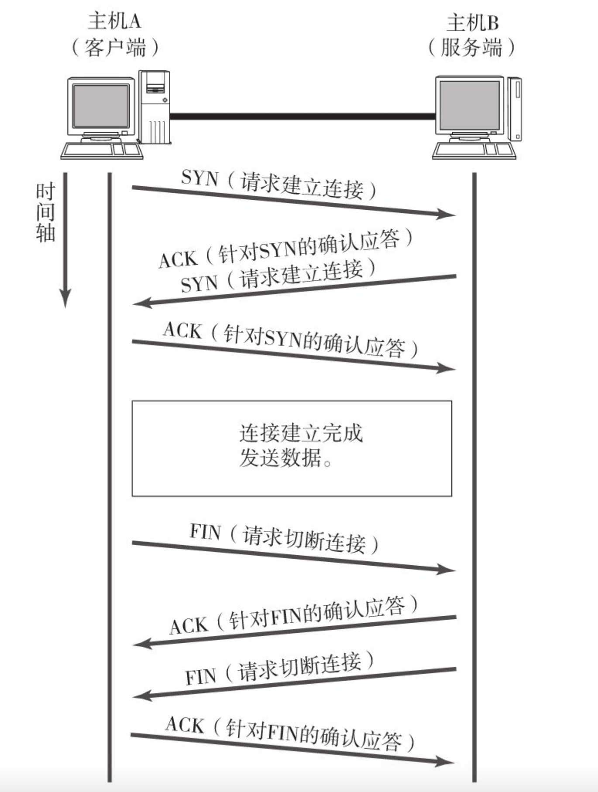

## TCP/IP

#### TCP

面向有连接的可靠的传输层协议，保证通信两端的数据可达。

为了建立断开连接，至少进行7次收发包的工作。

使用“顺序控制”“重发控制”机制，还有“流控制”

#### 三次握手与四次挥手

* 为什么是四次挥手？

  > 应答机制必须发送ACK
  >
  > 全双工通信，服务端可能还有数据处理，处理完毕之后再发送FIN信号

TCP通过肯定的确认应答（ACK）实现可靠的数据传输，发送端会等待对方的确认应答。如果有确认应答，说明数据成功传送，否则数据丢失的可能性比较大。

#### UDP 

面向无连接的传输层协议，不会关注对端是否真正收到了数据，适合于广播、多播情形，实时性和告诉传播场景

* 音视频
* 包总量小
* 广播

#### IP

面向无连接，为了简化和提速，需要有连接的时候可以委托上一层实现（TCP提供可靠性）。

#### IPV4

32位，使用10进制表示

#### IPV6

地址扩大，性能提升，认证加密

128位，16位为一组，用冒号隔开，采用二进制和16进制表示